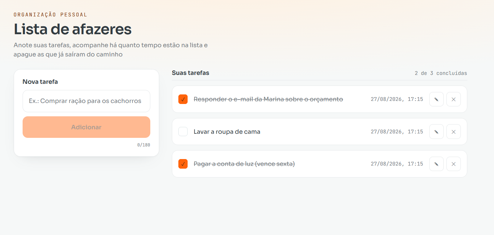

# Lista de afazeres



## Como rodar

**Pré-requisitos:** Node.js 20 ou superior.

```bash
# clone o repositório
git clone https://github.com/taynasales/desafio-todo-list.git
cd desafio-todo-list

# instale as dependências
npm install

# rode em modo de desenvolvimento
npm run dev
```

A aplicação ficará disponível em `http://localhost:5173`.
