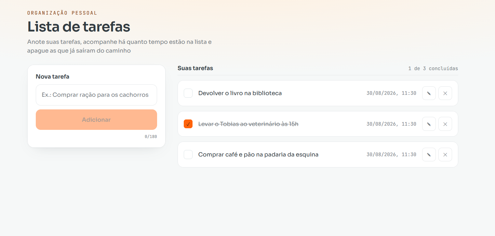

# Lista de tarefas

| Desktop                        | Mobile                       |
| ------------------------------ | ---------------------------- |
|  |  |

## Como rodar

**Pré-requisitos:** Node.js 20 ou superior.

```bash
# clone o repositório
git clone https://github.com/taynasales/desafio-todo-list.git
cd desafio-todo-list

# instale as dependências
npm install

# rode em modo de desenvolvimento
npm run dev
```

A aplicação ficará disponível em `http://localhost:5173`.

## Decisões técnicas

**Escopo.** Além de criar, listar e excluir, implementei também concluir e editar.

**Estado com `useState`.** A árvore tem um único nível de repasse de props. Avaliei Context, mas o custo do Provider e da memoização não se justificaria nesse caso. Migraria se a árvore ganhasse profundidade.

**Sem React Query ou SWR.** Resolvem cache de estado de servidor, e o projeto não tem backend.
